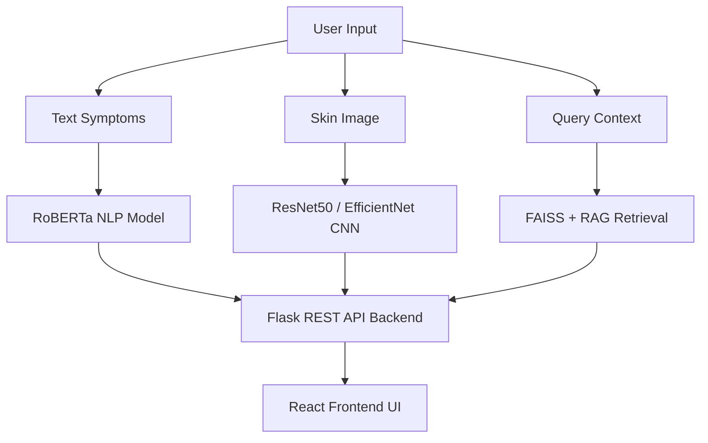
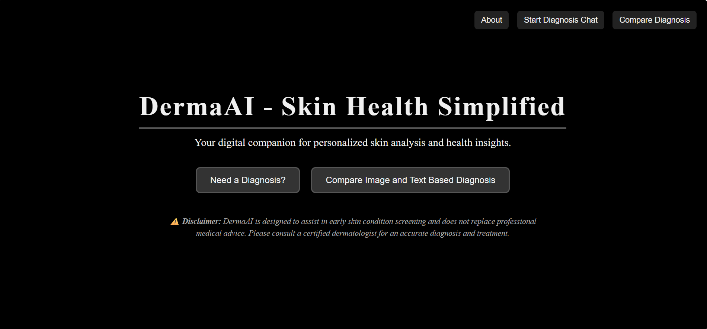
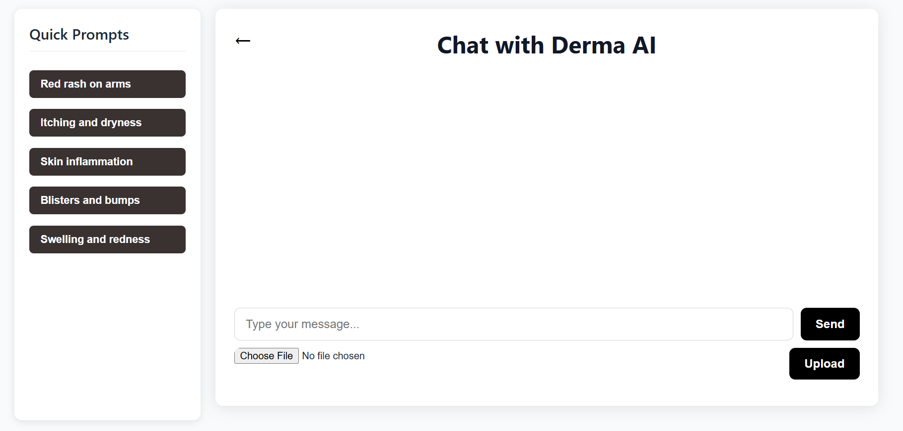
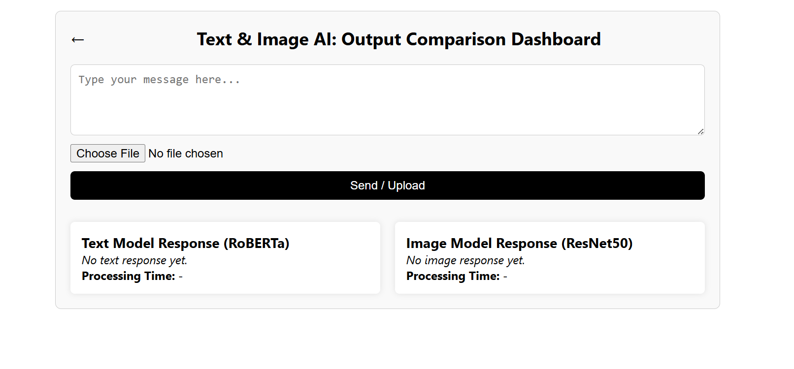

# DermaAI — AI-Powered Skin Disease Diagnosis Platform

## Intelligent Multi-Modal Skin Disease Detection using Deep Learning & NLP

## **Overview**

DermaAI is an AI-powered dermatology assistant designed to provide preliminary skin disease analysis through both:

🖼️ Image-based diagnosis

💬 Textual symptom analysis

The platform combines Computer Vision, Natural Language Processing, and Retrieval-Augmented Generation (RAG) techniques to create a multi-modal healthcare assistant capable of comparing image and text-based predictions for improved diagnostic reliability.

Unlike traditional systems that rely on a single input type, DermaAI integrates both visual and textual understanding into one unified experience.

## **✨ Key Features**

🔍 AI-powered skin disease prediction

🧠 Text-based symptom analysis using RoBERTa

🖼️ Image-based diagnosis using ResNet50 / EfficientNet

⚡ Fast Flask REST API backend

💬 Interactive chatbot-style interface

🔄 Comparative diagnosis dashboard

📚 RAG-enhanced medical knowledge retrieval

🧩 Modular and scalable architecture

🌐 Responsive React frontend

🛡️ Confidence-based prediction filtering

📈 Ongoing model improvement and expansion

## **🧠 AI Models & Technologies**

### **NLP Pipeline**

RoBERTa

HuggingFace Transformers

Symptom classification

Semantic similarity matching

### **Computer Vision Pipeline**

ResNet50

EfficientNet

PyTorch

OpenCV preprocessing

RAG Pipeline

Sentence Transformers

FAISS Vector Search

### **Knowledge Base Retrieval**

Full Stack

React.js

Flask REST API

## **🏗️ System Architecture**

## **📸 Application Screens**

### **🏠 Homepage**

### **💬 AI Diagnosis Chat Interface**

### **🔄 Comparative Diagnosis Dashboard**

### **ℹ️ About Page**

## **🎯 Problem Statement**

Millions of people worldwide lack immediate access to dermatological consultation. Existing systems often:

- rely solely on image-based prediction
 
- lack conversational interaction

- do not compare textual and visual diagnosis

- provide limited accessibility

**DermaAI addresses these limitations by integrating:**

- NLP symptom understanding

- image classification

- comparative diagnostic logic

- AI-assisted chatbot interaction

to support early awareness and accessible preliminary screening.

## **⚙️ Tech Stack**

### **Category**	            **Technologies**

- Frontend	            - React.js, HTML, CSS, Bootstrap

- Backend     	         - Flask, Flask-RESTful

- AI/ML	               - PyTorch, Transformers, OpenCV

- NLP	                  - RoBERTa, Sentence Transformers

- Retrieval	            - FAISS

- Version Control      	- Git & GitHub

- Development Tools	   - VS Code, Google Colab, Postman

## **🚀 Getting Started**

### **1️⃣ Clone Repository**

git clone https://github.com/ashfiatanveer/SkinDiseaseDiagnosisChatbot.git

cd SkinDiseaseDiagnosisChatbot

### **2️⃣ Backend Setup**

Create virtual environment:

python -m venv chatbot_env

### **Activate environment:**

Windows

chatbot_env\Scripts\activate

### **Install dependencies:**

pip install -r requirements.txt

### **Run Flask backend:**

python ChatbotNew-RAG.py

Backend runs on:

http://127.0.0.1:5001

## **3️⃣ Frontend Setup**

### **Install packages:**

npm install

### **Start React app:**

npm start

Frontend runs on:

http://localhost:3000

## **📊 Current Capabilities**

✅ Multi-modal diagnosis

✅ Chatbot-style interaction

✅ Comparative prediction system

✅ 15-class disease classification

✅ Real-time predictions

✅ Confidence threshold handling

✅ Responsive UI

✅ REST API architecture

## **🧪 Testing & Evaluation**

The system was evaluated through:

- unit testing

- functional testing

- API validation

- model confidence analysis

frontend/backend integration testing

## **The project achieved:**

- fast prediction response times

- high classification accuracy

- stable frontend/backend communication

- scalable modular architecture

## **🔮 Future Roadmap**

DermaAI is an actively evolving project. Planned future enhancements include:

📱 Android & iOS mobile applications

🌍 Multilingual support

🩺 Live dermatologist consultation

🧠 Personalized treatment recommendations

☁️ Cloud deployment & scalability

📈 Continuous model retraining

🧾 Prediction history & authentication

🏥 Healthcare system integration

🔊 Voice-based symptom input

🧬 Advanced RAG-powered medical assistance

## **⚠️ Medical Disclaimer**

DermaAI is designed for educational and preliminary screening purposes only.

The system does not replace professional medical advice, diagnosis, or treatment. Users are strongly encouraged to consult certified dermatologists for accurate clinical evaluation.

## **🌟 Project Status**

### **🚧 Ongoing & Continuously Improving**

This project is actively being expanded with:

- enhanced AI capabilities

- improved datasets

- additional disease coverage

- optimized inference pipelines

- advanced healthcare assistance features

